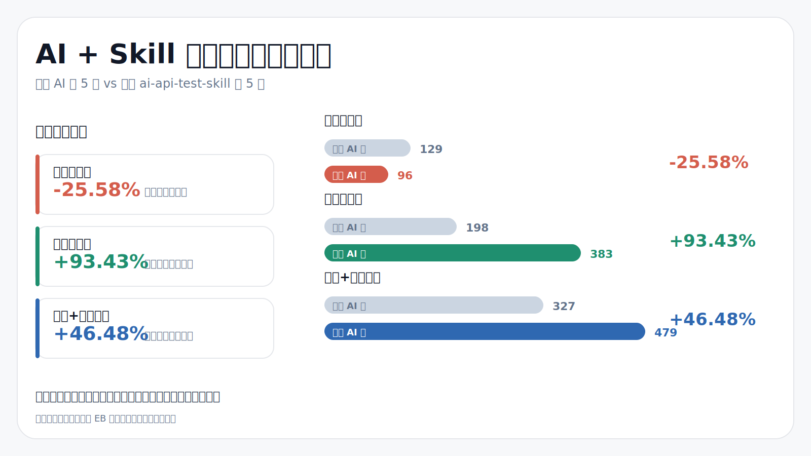

# ai-api-test-skill

简体中文 | [English](./README_EN.md) 

面向 `Python + pytest + requests` 接口自动化项目的 [AI Skill](./SKILL.md)：让 Codex / Claude Code 按固定门禁、固定流程、固定 pytest 闭环来新增和维护接口自动化用例，流程图参考：[flow_chart/flow.md](./flow_chart/flow.md)。

它不是一个普通的提示词模板，而是一套可随仓库分发的工程化 Skill：会先校验任务信息，再按“抓包 / 参考用例 / cURL / Java Controller / pytest 报错”选择路径，最后把接口方法、接口用例和测试验证收敛到同一套规范里。



## 项目特色

这个项目更适合**没有接口文档、接口文档不规范、接口链路复杂、历史用例多的大型开发项目**。在这类项目里，直接 vibe coding 很容易漏上下文、误改文件或重复封装接口；`ai-api-test-skill` 的做法是把个人和团队日常编写、维护接口自动化用例的流程复刻成一套可执行的 AI 工作流，再用 `Harness engineering` 思路给 AI 加上明确的边界、门禁和反馈回路。

核心特色集中在 5 点：

- **前置门禁约束修改边界**：强制填写接口方法文件、接口方法位置、接口用例文件、接口用例位置和用例名，避免 AI 不知道写在哪里而大范围改动已有文件。
- **渐进式披露降低上下文噪音**：新增、维护、抓包、参考用例、cURL、Controller、pytest 报错驱动等流程拆成子文档，按任务类型只读取必要规范。
- **真实流量驱动用例生成**：内置抓包服务脚本，把 UI 操作产生的真实请求链路转成可分析的接口自动化输入。
- **SQLite 接口资产索引**：首次全量扫描已有接口 URL 与 method，后续增量追加；AI 可通过数据库毫秒级定位接口方法所在文件和行号，减少大量 `grep` 调用和 token 消耗。
- **pytest 闭环验证结果**：用例编写完成后必须执行目标 pytest，根据真实报错继续修复，直到通过或明确说明环境问题。

当前默认模板输出风格为 `pytest`，可通过调整 `doc/coding_style_guide.md`、任务门禁和用例模板来适配团队自己的接口自动化编码规范，并作为适配 `unittest`、`httpx`、`aiohttp` 等框架的基础。

## 实际编写案例记录

- [通过AI+SKILL编写自动化测试用例记录](https://www.yuque.com/bbuer/ebdyfe/gpxaqwd5gnwk3bqt?singleDoc#)
- [通过AI+SKILL维护用例的测试记录](https://www.yuque.com/bbuer/ebdyfe/bua08uq469osgla1?singleDoc#)

## 快速开始

> 详细的使用手册参考：[detailedUserManual.md](./detailedUserManual.md)。

### 1. 准备环境

| 项 | 要求 |
|---|---|
| OS | Windows 10/11 |
| Python | >= 3.8 |
| 测试框架 | pytest |
| HTTP 客户端 | requests |
| 抓包能力 | `pip install mitmproxy`，验证：`mitmdump --version` |

第三方 Skill 建议：

| 用途 | Skill | 安装命令 |
|---|---|---|
| pytest 失败修复 | `/test-fixing` | `npx skills add sickn33/antigravity-awesome-skills@test-fixing -g -y` |
| Python 断点调试 | `/Debugging` | `npx skills add pluginagentmarketplace/custom-plugin-python@debugging -g -y` |

### 2. 初始化配置

本 Skill 随仓库分发，通常放在项目的 `.claude/skills/api-test-E10/` 或等价 skill 目录下。首次接入非 E10 项目时，先配置 `config.json` 中的项目路径、接口目录、用例目录和 pytest 工作目录。

常用命令：

```bash
python tools/preflight_check.py
python tools/scan_page_api.py
python tools/scan_page_api.py --full
```

### 3. 发送任务信息给 AI

新增用例任务，使用如下的提示词触发使用SKILL：

```markdown
我要新增接口自动化测试用例
```

预期AI回复下方的新增用例填写模板，如果没有回复就是AI触发不成功，或SKILL执行异常

```markdown
# 本次任务信息
- `[接口方法文件]` = `填写接口方法所在文件路径`（无新增时填：当前用例无新增接口）
- `[接口方法位置]` = `填写接口方法新增位置，例如：文件末尾 / 第123行后 / 某方法后`（无新增时填：当前用例无新增接口）
- `[接口用例文件]` = `填写接口用例所在文件路径`
- `[接口用例位置]` = `填写接口用例新增位置，例如：文件末尾 / 第456行插入 / 某用例后 / 完善某用例`
- `[fixture]` = `选填：接口用例的前后置fixture`
- `[用例名]` = `填写本次新增用例的完整中文功能名称`
```

维护已有用例，同样输入：**我要维护接口用例**的提示词，预期返回如下的维护用例填写模板：

```markdown
# 本次维护任务信息
- `[接口用例文件]` = `填写接口用例所在文件路径`
- `[接口用例位置]` = `填写具体的待维护的单个/多个用例，例如：test_xxx / 某测试类下的多个用例 / 第456行附近的 xxx 用例`
```

## 工作流

完整决策树见：[flow_chart/flow.md](./flow_chart/flow.md)。README 只保留流程速查：

| 任务类型 | 方式 | 适合场景 | 详细流程 |
|---|---|---|---|
| 新增 | 抓包驱动 | 新接口多、链路复杂 | [`doc/mode_capture_driven.md`](./doc/mode_capture_driven.md) |
| 新增 | 参考已有用例 | 同类批量、参数断言调整 | [`doc/mode_reference_case.md`](./doc/mode_reference_case.md) |
| 新增 | cURL 手工 | 抓包不可用、数据过大 | [`doc/mode_curl_manual.md`](./doc/mode_curl_manual.md) |
| 新增 | Java Controller 源码参考 | 后端已有接口定义但自动化未覆盖 | [`doc/mode_java_controller_source.md`](./doc/mode_java_controller_source.md) |
| 维护 | 抓包驱动 | 链路变化大、多接口联动 | [`doc/mode_maintenance_capture_driven.md`](./doc/mode_maintenance_capture_driven.md) |
| 维护 | 参考已有用例 | 同类结构稳定 | [`doc/mode_maintenance_reference_case.md`](./doc/mode_maintenance_reference_case.md) |
| 维护 | cURL 手工 | 少量接口变化明确 | [`doc/mode_maintenance_curl_manual.md`](./doc/mode_maintenance_curl_manual.md) |
| 维护 | pytest 报错驱动 | 指定失败用例后让 AI 自行维护 | [`doc/mode_maintenance_pytest_driven.md`](./doc/mode_maintenance_pytest_driven.md) |

## 抓包模式

抓包服务启动、证书安装、代理设置、过滤规则和常见问题见：[capture/README.md](./capture/README.md)。

## 项目结构

```text
.
├── README.md                    # 默认简体中文说明文档
├── README_EN.md                 # 英文说明文档
├── SKILL.md                     # AI 执行规范入口
├── detailedUserManual.md        # 详细的使用手册
├── doc/                         # 前置门禁、核心原则、四种新增/维护模式说明
├── tools/                       # 接口索引、抓包匹配、Controller 分析等工具脚本
├── capture/                     # mitmproxy 抓包服务与过滤配置
├── skill_utils/                 # 多工具复用的路径、配置、索引等公共能力
├── hooks/                       # Claude Code / Codex 前置 hook
├── flow_chart/                  # Mermaid 流程图源码
└── config.json                  # 运行时配置
```

## 进一步阅读

| 文档 | 用途 |
|---|---|
| [`SKILL.md`](./SKILL.md) | AI 执行规范入口 |
| [`doc/preflight_gates_new.md`](./doc/preflight_gates_new.md) | 新增任务前置门禁 |
| [`doc/preflight_gates_maintenance.md`](./doc/preflight_gates_maintenance.md) | 维护任务前置门禁 |
| [`doc/core_principles.md`](./doc/core_principles.md) | 核心原则 |
| [`doc/coding_style_guide.md`](./doc/coding_style_guide.md) | 接口方法/用例编码风格 |
| [`flow_chart/flow.md`](./flow_chart/flow.md) | 完整流程图 |
| [`capture/README.md`](./capture/README.md) | 抓包配置细节 |
| [`detailedUserManual.md`](./detailedUserManual.md) | 详细的使用手册 |

## 友情链接

- [Linux do](https://linux.do/)
