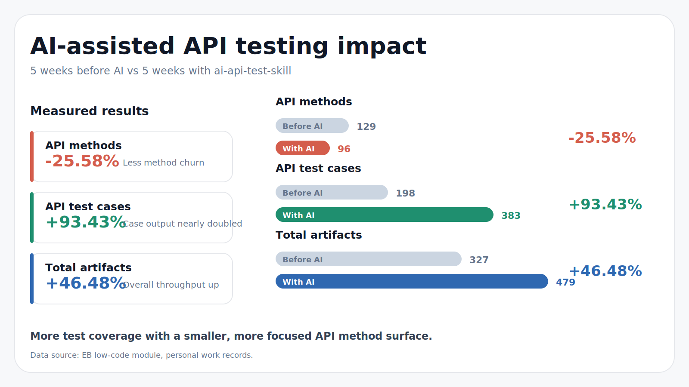

# ai-api-test-skill

English | [简体中文](./README.md)

An [AI Skill](./SKILL.md) for `Python + pytest + requests` API automation projects. It helps Codex / Claude Code generate, maintain, and debug API tests through repeatable gates, workflow choices, API indexing, capture analysis, and pytest verification. Workflow chart: [flow_chart/flow.md](./flow_chart/flow.md).

It is not a simple prompt template. It is a repository-distributed engineering Skill: it validates task information first, then routes work through capture, reference-case, cURL, Java Controller, or pytest-error workflows, and finally keeps API methods, API test cases, and test verification under one consistent process.



## Project Features

This project is especially useful for **large projects with missing API docs, inconsistent API docs, complex request chains, and many existing tests**. In this environment, pure vibe coding can easily miss context, edit the wrong files, or duplicate endpoint wrappers. `ai-api-test-skill` turns a real team's daily API-test creation and maintenance workflow into an executable AI workflow, then uses `Harness engineering` to give the agent explicit boundaries, gates, and feedback loops.

Key features:

- **Preflight gates constrain edit boundaries**: require API method file, method insertion point, test file, test insertion point, and scenario name before code changes.
- **Progressive disclosure keeps context small**: creation, maintenance, capture, reference-case, cURL, Controller, and pytest-error workflows are split into task-specific docs.
- **Real traffic drives test generation**: mitmproxy captures turn UI operations into analyzable API-test inputs.
- **SQLite API asset index**: full initial scan plus incremental updates let the agent locate reusable endpoint methods by URL and method in milliseconds, reducing repeated `grep` calls and token usage.
- **pytest closure verifies results**: generated or maintained tests must run through target pytest verification, then iterate on real errors until passed or blocked by environment issues.

The default template style is `pytest`, but teams can adjust `doc/coding_style_guide.md`, task gates, and test templates to fit their own API automation conventions and extend toward `unittest`, `httpx`, or `aiohttp`.

## Case Records

- [API test-case generation record with AI + Skill](https://www.yuque.com/bbuer/ebdyfe/gpxaqwd5gnwk3bqt?singleDoc#)
- [API test-case maintenance record with AI + Skill](https://www.yuque.com/bbuer/ebdyfe/bua08uq469osgla1?singleDoc#)

## Quick Start

> Detailed user manual: [detailedUserManual.md](./detailedUserManual.md).

### 1. Requirements

| Item | Requirement |
|---|---|
| OS | Windows 10/11 |
| Python | >= 3.8 |
| Test framework | pytest |
| HTTP client | requests |
| Capture support | `pip install mitmproxy`, verify with `mitmdump --version` |

Recommended third-party Skills:

| Purpose | Skill | Install command |
|---|---|---|
| pytest failure fixing | `/test-fixing` | `npx skills add sickn33/antigravity-awesome-skills@test-fixing -g -y` |
| Python breakpoint debugging | `/Debugging` | `npx skills add pluginagentmarketplace/custom-plugin-python@debugging -g -y` |

### 2. Initialize Configuration

This Skill is distributed with the repository, usually under `.claude/skills/api-test-E10/` or an equivalent Skill directory. When connecting a non-E10 project for the first time, configure `config.json` with the project root, API method directories, test case directories, and pytest workdir.

Common commands:

```bash
python tools/preflight_check.py
python tools/scan_page_api.py
python tools/scan_page_api.py --full
```

### 3. Send Task Information to the Agent

For creation tasks, use the following prompt to trigger the Skill:

```markdown
我要新增接口自动化测试用例
```

The expected response is the creation-task template below. If it does not appear, the Skill may not have triggered or may have failed.

Creation task:

```markdown
# 本次任务信息
- `[接口方法文件]` = `API method file path, or 当前用例无新增接口`
- `[接口方法位置]` = `method insertion position, or 当前用例无新增接口`
- `[接口用例文件]` = `test case file path`
- `[接口用例位置]` = `test insertion position`
- `[fixture]` = `optional fixtures`
- `[用例名]` = `complete Chinese test scenario name`
```

For maintenance tasks, use: **我要维护接口用例**. The expected response is the maintenance-task template below.

```markdown
# 本次维护任务信息
- `[接口用例文件]` = `test case file path`
- `[接口用例位置]` = `specific test function/class/line area to maintain`
```

## Workflows

Full decision tree: [flow_chart/flow.md](./flow_chart/flow.md). This README keeps only the quick workflow map:

| Task | Workflow | Best For | Details |
|---|---|---|---|
| Creation | Capture-driven | New endpoints and complex flows | [`doc/mode_capture_driven.md`](./doc/mode_capture_driven.md) |
| Creation | Reference case | Batch generation for similar APIs | [`doc/mode_reference_case.md`](./doc/mode_reference_case.md) |
| Creation | cURL/manual | Clear request/response data without capture | [`doc/mode_curl_manual.md`](./doc/mode_curl_manual.md) |
| Creation | Java Controller reference | Backend definitions exist but API tests are missing | [`doc/mode_java_controller_source.md`](./doc/mode_java_controller_source.md) |
| Maintenance | Capture-driven | Business flow changed across multiple APIs | [`doc/mode_maintenance_capture_driven.md`](./doc/mode_maintenance_capture_driven.md) |
| Maintenance | Reference case | Stable test style with parameter/assertion updates | [`doc/mode_maintenance_reference_case.md`](./doc/mode_maintenance_reference_case.md) |
| Maintenance | cURL/manual | Small and explicit endpoint changes | [`doc/mode_maintenance_curl_manual.md`](./doc/mode_maintenance_curl_manual.md) |
| Maintenance | pytest error driven | Point the agent at failing tests and let it iterate | [`doc/mode_maintenance_pytest_driven.md`](./doc/mode_maintenance_pytest_driven.md) |

## Capture Mode

Capture server startup, certificate installation, browser proxy setup, filtering rules, and troubleshooting are documented in [capture/README.md](./capture/README.md).

## Project Structure

```text
.
├── README.md                    # Default Simplified Chinese README
├── README_EN.md                 # English README
├── SKILL.md                     # Agent execution manual entry
├── detailedUserManual.md        # Detailed user manual
├── doc/                         # Gates, principles, creation/maintenance modes
├── tools/                       # API index, capture matching, Controller analysis tools
├── capture/                     # mitmproxy capture service and filter config
├── skill_utils/                 # Shared config, path, and index utilities
├── hooks/                       # Claude Code / Codex preflight hooks
├── flow_chart/                  # Mermaid workflow source
└── config.json                  # Runtime configuration
```

## Documentation

| Document | Purpose |
|---|---|
| [`SKILL.md`](./SKILL.md) | Agent execution manual entry |
| [`doc/preflight_gates_new.md`](./doc/preflight_gates_new.md) | Creation-task preflight gate |
| [`doc/preflight_gates_maintenance.md`](./doc/preflight_gates_maintenance.md) | Maintenance-task preflight gate |
| [`doc/core_principles.md`](./doc/core_principles.md) | Core principles |
| [`doc/coding_style_guide.md`](./doc/coding_style_guide.md) | API method and test-case coding style |
| [`flow_chart/flow.md`](./flow_chart/flow.md) | Full workflow chart |
| [`capture/README.md`](./capture/README.md) | Capture setup details |
| [`detailedUserManual.md`](./detailedUserManual.md) | Detailed user manual |

## Community Link

- [Linux do](https://linux.do/)
