# api-test-E10 执行流程图

本文件使用 [Mermaid](https://mermaid.js.org/) 绘制。VSCode / GitHub / Obsidian / Typora 等均可直接渲染。

> 新增任务前置门禁见 `doc/preflight_gates_new.md`，维护任务前置门禁见 `doc/preflight_gates_maintenance.md`。新增任务的四种方式已拆分到 `doc/mode_capture_driven.md`、`doc/mode_reference_case.md`、`doc/mode_curl_manual.md`、`doc/mode_java_controller_source.md`；维护任务的四种方式已拆分到 `doc/mode_maintenance_*.md`，维护共用提示词见 `doc/maintenance_prompt_context.md`。本文件仅维护流程图与决策关系。

---

## 一、总览（入口流程）

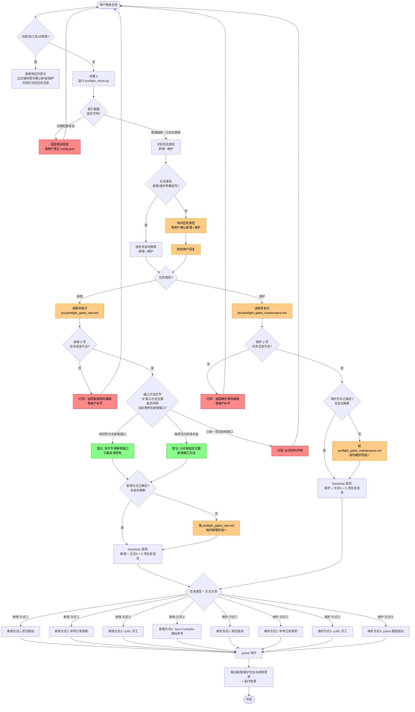

---

## 二、前置 0 / 新增前置 / 维护前置决策闸门

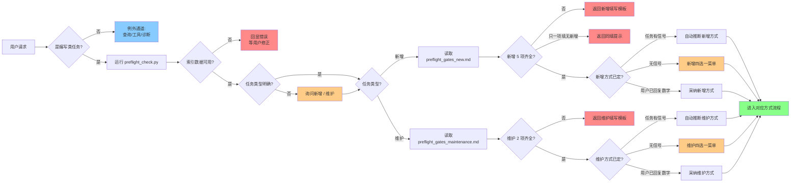

---

## 三、新增任务总览（入口到方式分流）

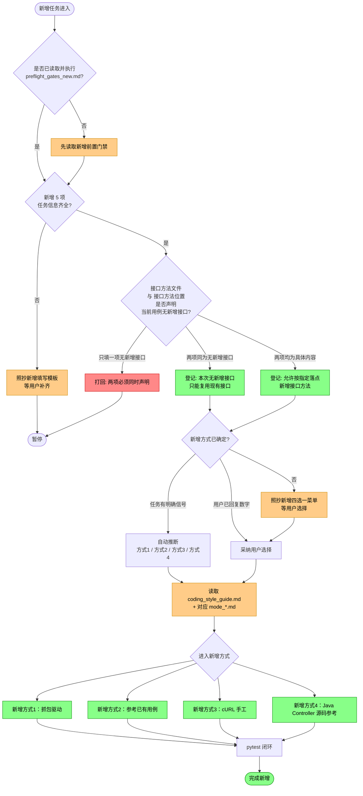

### 新增任务关键原则

- 新增前先读取 `doc/preflight_gates_new.md`，并完成 5 项任务信息校验。
- `[fixture]` 为选填，不参与缺项判定；其余字段必须是真实文件、真实位置和完整中文用例名。
- `[接口方法文件]` 与 `[接口方法位置]` 可同时声明“当前用例无新增接口”；只声明一项时必须打回。
- 声明“无新增接口”后，后续只能复用仓库现有接口方法，不得新增接口方法。
- 方式未明确时必须照抄新增四选一菜单；有明确抓包、参考样本、cURL 或 Java Controller/Jacoco 信号时可自动推断。
- 进入具体方式前，必须读取 `doc/coding_style_guide.md` 与对应 `doc/mode_*.md`。

---

## 四、新增方式①：抓包驱动

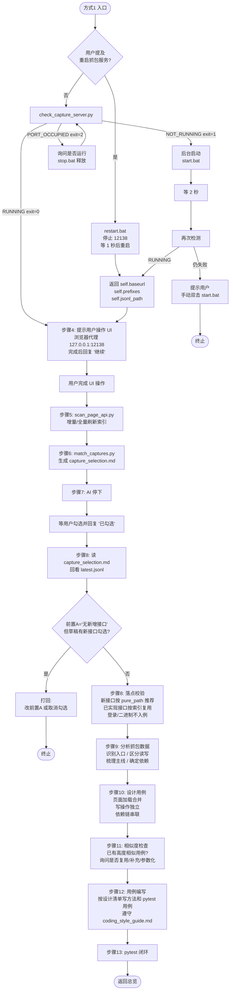

### 方式① 关键动作与产物

| 步骤 | 动作 | 产物/输出 |
|---|---|---|
| 1 | 判断是否需要重启 | 用户是否明确提及重启抓包服务 |
| 2 | 二选一处理抓包服务 | 重启：`restart.bat`；未重启：检查端口并按需 `start.bat` |
| 3 | 返回服务信息 | `self.baseurl` / `self.prefixes` / `self.jsonl_path` |
| 4 | 提示用户操作 UI | 浏览器代理与证书提示，完成后回复“继续” |
| 5 | 刷新索引 | `tools/page_api_index.sqlite3` |
| 6 | 生成草稿 | `api_test_dwp_temp/capture_selection.md` |
| 7 | 等用户勾选 | `[x]/[ ]` 标记，AI 不得擅自续跑 |
| 8 | 读勾选结果与落点校验 | 只处理用户确认勾选接口；新接口校验新增前置门禁，已实现接口按索引复用 |
| 9 | 分析抓包数据 | 入口请求、读写类型、业务主线、接口依赖关系 |
| 10 | 设计用例 | 页面加载合并，写操作独立，依赖链串联 |
| 11 | 相似度检查 | 高度相似用例处理建议，按用户确认复用/补充/参数化 |
| 12 | 用例编写 | 新方法写入 `[接口方法文件]`，新用例写入 `[接口用例文件]` |
| 13 | pytest 闭环 | 执行日志 + 通过/失败统计 |

---

## 五、新增方式②：参考已有用例

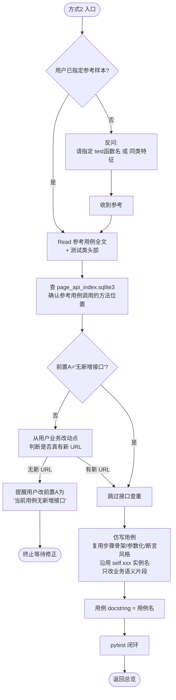

### 方式② 关键原则（禁止行为）

| 动作 | 是否允许 |
|---|---|
| 为新用例增加参考没有的能力（如分组、排序） | ❌ 禁止 |
| 把简化参考改成复杂版本 | ❌ 禁止 |
| 为新用例挂 `@pytest.mark.skip` | ❌ 除非用户声明"写占位" |
| 引入参考用例没有的 API 实例 | ❌ 禁止 |
| 修改参考用例本身 | ❌ 禁止（除非用户要求） |

---

## 六、新增方式③：cURL 手工

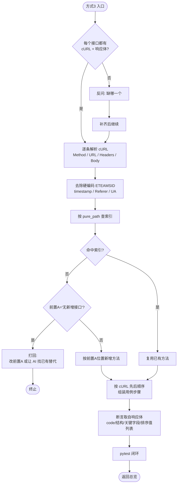

### 方式③ cURL 处理清单

| cURL 项 | 处理方式 |
|---|---|
| `-X GET/POST/PUT/DELETE` | 作为接口方法的 method 参数 |
| `--url "https://host/api/xxx?a=1"` | 拆 pure_path + query 参数 |
| `-H "Cookie: ETEAMSID=xxxx"` | 删除硬编码，改用 `login_api_new` 动态获取 |
| `-H "Content-Type: application/json"` | 保留 |
| `-H "Referer: ..."` / `-H "User-Agent: ..."` | 删除，不写入方法 |
| `-d '{"a":1,"timestamp":...}'` | `timestamp/_t` 改为调用时生成 |
| `--data-urlencode` | 按 form 编码落入 payload |

---

## 七、新增方式④：Java Controller 源码参考

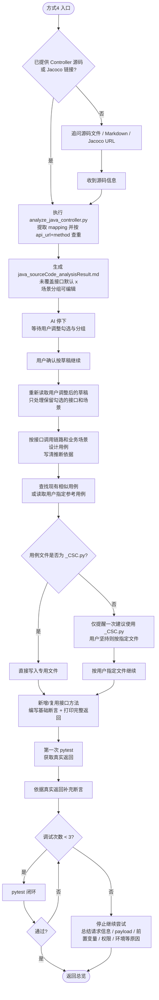

### 方式④ 关键动作与产物

| 步骤 | 动作 | 产物/输出 |
|---|---|---|
| 1 | 读取 Controller/Jacoco | Java 源码、行号、Jacoco `fc`/`nc`/`bnc`（如有） |
| 2 | 提取接口并查重 | 类级 + 方法级 mapping 拼完整 URL，以 `api_url + method` 查 `page_api_index.sqlite3` |
| 3 | 生成可编辑草稿 | `api_test_dwp_temp/java_sourceCode_analysisResult.md` |
| 4 | 用户调整草稿 | 勾选接口、调整场景分组、补充参考用例备注 |
| 5 | 设计用例 | 按调用链路拆分，不机械把所有 `[x]` 接口写成一条用例 |
| 6 | 参考已有用例 | AI 自行检索或按用户指定参考用例复用 fixture、payload、断言风格 |
| 7 | 编写 `_CSC.py` 用例 | 非 `_CSC.py` 只提醒一次，用户可强行指定其它文件 |
| 8 | 两阶段断言 | 先基础断言并打印返回，再按真实返回补充断言 |
| 9 | pytest 闭环 | 最多调试 3 次，不通过则总结原因并停止 |

---

## 八、维护任务总览（入口到方式分流）

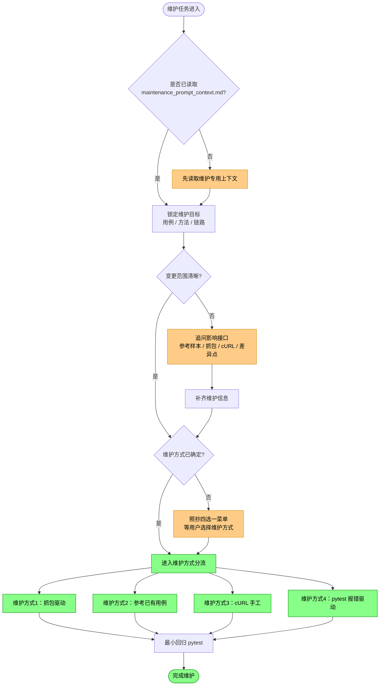

### 维护任务关键原则

- 先找现有实现，不先假设要新建。
- 先判断“只改用例”还是“方法 + 用例一起改”。
- 变更范围大时优先抓包回溯，变更点明确时优先参考样本或 cURL 快修。
- 用户要求 AI 直接运行目标用例并按报错维护时，使用 pytest 报错驱动；该方式默认先用 `/test-fixing`，维护困难或调用栈/前后接口信息不明确时再用 `/Debugging`。
- 维护场景允许新增方法，但新增只是修补手段，不是任务目标。
- 维护时优先跑受影响用例或最小回归集，不默认全量回归。

---

## 九、维护方式①：抓包驱动

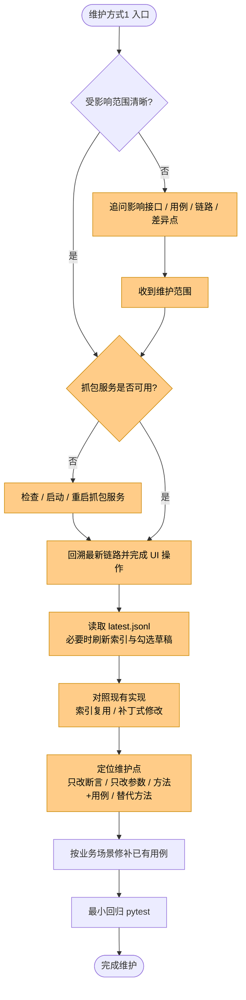

### 维护方式① 关键动作与产物

| 步骤 | 动作 | 产物/输出 |
|---|---|---|
| 1 | 锁定影响范围 | 受影响的接口、用例、链路、差异点 |
| 2 | 检查抓包服务 | 是否需要启动 / 重启 / 保持当前服务 |
| 3 | 获取最新链路 | `latest.jsonl`、必要时索引与勾选草稿 |
| 4 | 对照现有实现 | 可复用方法、需补丁方法、受影响用例 |
| 5 | 定位维护点 | 断言 / 参数 / fixture / 调用 / 替代方法 |
| 6 | 按业务场景修补 | 最小范围修复已有用例 |
| 7 | 最小回归 | 受影响用例或最小回归集 pytest |

---

## 十、维护方式②：参考已有用例

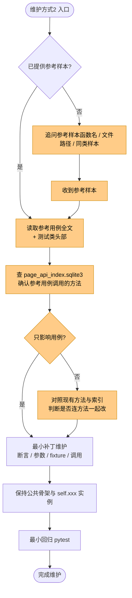

### 维护方式② 关键原则（禁止行为）

| 动作 | 是否允许 |
|---|---|
| 为维护用例增加参考没有的能力（如分组、排序） | ❌ 禁止 |
| 把局部修补改成复杂重构 | ❌ 禁止 |
| 为维护用例挂 `@pytest.mark.skip` | ❌ 除非用户声明"写占位" |
| 引入参考样本没有的 API 实例 | ❌ 禁止 |
| 修改参考用例本身 | ❌ 禁止（除非用户要求） |

---

## 十一、维护方式③：cURL 手工

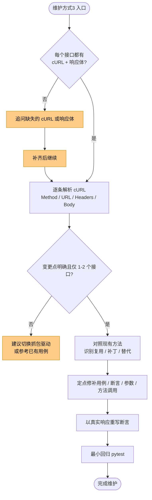

### 维护方式③ cURL 处理清单

| cURL 项 | 处理方式 |
|---|---|
| `-X GET/POST/PUT/DELETE` | 作为接口方法的 method 参数 |
| `--url "https://host/api/xxx?a=1"` | 拆 pure_path + query 参数 |
| `-H "Cookie: ETEAMSID=xxxx"` | 删除硬编码，改用登录 fixture 动态获取 |
| `-H "Content-Type: application/json"` | 保留 |
| `-H "Referer: ..."` / `-H "User-Agent: ..."` | 删除，不写入方法 |
| `-d '{"a":1,"timestamp":...}'` | `timestamp/_t` 改为调用时生成 |
| `--data-urlencode` | 按 form 编码落入 payload |

---

## 十二、维护方式④：pytest 报错驱动

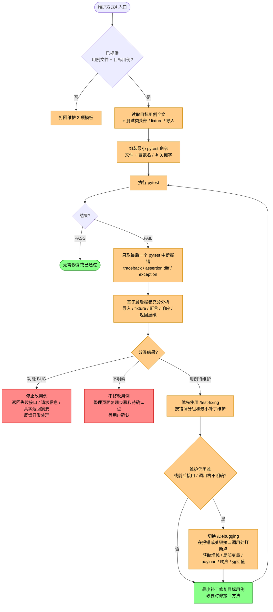

### 维护方式④ 执行清单

| 步骤 | 动作 | 产物/输出 |
|---|---|---|
| 1 | 锁定目标 | `[接口用例文件]` + `[接口用例位置]` |
| 2 | 读取上下文 | 目标用例、测试类头部、fixture、导入和实例 |
| 3 | 运行 pytest | 最小范围命令、执行目录、PYTHONPATH |
| 4 | 取最后报错 | 只以最后一个 pytest 中断 traceback、断言差异、exception 作为分类依据 |
| 5 | 分类处理 | 功能 BUG 停止修改并反馈；不明确时返回复现步骤；用例待维护时进入修复 |
| 6 | 优先 `/test-fixing` | 对用例待维护问题按测试修复流程做最小补丁 |
| 7 | 兜底 `/Debugging` | `/test-fixing` 无法解决或接口前后信息不明确时，打断点并读取堆栈、局部变量、payload、响应和返回值辅助定位 |
| 8 | 循环验证 | 同一最小范围 pytest 直到通过或重新分类为 BUG / 不明确 / 非代码问题 |

---

## 十三、pytest 闭环（新增四方式 / 维护四方式共用）

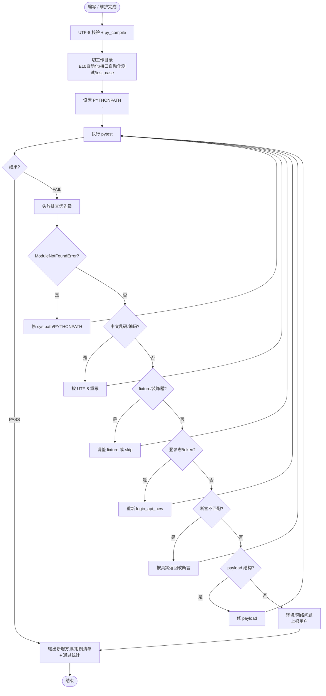

---

## 十四、方式对比速查

| 维度 | 方式1 抓包 | 方式2 参考 | 方式3 cURL | 方式4 Java Controller |
|---|---|---|---|---|
| 典型场景 | 新接口多 / 复杂链路 | 同类用例批量 / 修改参数 | 抓包不可用 / 数据过多 | 后端已有接口定义但自动化未覆盖 |
| 用户准备成本 | 低（UI 操作即可） | 中（指定参考） | 高（收集 cURL + 响应） | 中（提供 Controller/Jacoco） |
| 新接口能力 | ✅ 索引驱动查重 | ⚠️ 默认不新增，必要时新增 | ✅ 按 cURL 新增 | ✅ 按源码提取后查重新增 |
| AI 主观判断 | 低（索引 + 草稿） | 中（仿写需理解参考） | 中（需理解 cURL 语义） | 中高（需设计调用链路和场景分组） |
| 最常见失败 | 登录态 / 浏览器代理 | 参考样本选错 | cURL 不全 / 响应缺失 | payload/前置变量从源码无法完整确定 |
| 闭环严格度 | 强（草稿必停等） | 强（参考必 Read） | 强（cURL+响应必配对） | 强（源码分析草稿必停等，调试最多 3 次） |

### 维护方式速查

| 维度 | 维护方式1 抓包 | 维护方式2 参考 | 维护方式3 cURL | 维护方式4 pytest |
|---|---|---|---|---|
| 典型场景 | 多接口/多用例链路变更 | 单用例或同类用例局部修补 | 1-2 个接口的定点修复 | 直接按失败用例报错修复 |
| 用户准备成本 | 中（提供最新链路） | 低（提供参考样本） | 中（提供 cURL + 响应） | 低（提供目标用例） |
| 链路回溯能力 | 强（按最新链路回溯） | 中（依赖参考样本） | 弱（适合明确变更点） | 中（由报错反推） |
| 维护粒度 | 链路级 | 用例级 | 接口级 / 局部级 | 失败点级 |
| 最常见失败 | 抓包范围不全 | 参考样本选错 | 响应体/差异点不完整 | 报错属于环境/账号/会话问题，或需 `/Debugging` 补充调用栈 |
| 闭环严格度 | 强（最小回归） | 强（目标用例回归） | 强（受影响用例回归） | 强（同一目标 pytest 循环） |

---

## 十五、本流程图与 SKILL.md 的对应关系

| 流程图章节 | SKILL.md 对应章节 |
|---|---|
| 一、总览 | 🚨 前置门禁（按新增 / 维护分流读取） |
| 二、决策闸门 | 前置必跑 0 + `preflight_gates_new.md` / `preflight_gates_maintenance.md` |
| 三、新增任务总览 | `doc/preflight_gates_new.md` + 新增 mode 文件 |
| 四、新增方式① | `doc/mode_capture_driven.md` |
| 五、新增方式② | `doc/mode_reference_case.md` |
| 六、新增方式③ | `doc/mode_curl_manual.md` |
| 七、新增方式④ | `doc/mode_java_controller_source.md` |
| 八、维护任务总览 | `doc/maintenance_prompt_context.md` + 维护 mode 文件 |
| 九、维护方式① | `doc/mode_maintenance_capture_driven.md` |
| 十、维护方式② | `doc/mode_maintenance_reference_case.md` |
| 十一、维护方式③ | `doc/mode_maintenance_curl_manual.md` |
| 十二、维护方式④ | `doc/mode_maintenance_pytest_driven.md` |
| 十三、pytest 闭环 | 核心原则 → 5. 测试必须闭环 |
| 十四、对比速查 | 新增四方式 / 维护四方式共用规范 |
| 附录 A、Hook 触发时序 | 🚨 前置必跑 0（由 hook 自动执行）+ 项目级 `.claude/settings.json` 的 `hooks.PreToolUse` |

---

## 十六、维护说明

- 本文件与 `SKILL.md` 保持**双向一致**：修改任一侧流程，另一侧必须同步
- Mermaid 语法兼容性优先 GitHub 与 VSCode 的 Mermaid 插件
- 如流程图需要导出为图片，推荐 [Mermaid Live Editor](https://mermaid.live/)

---

## 附录 A、PreToolUse Hook 触发时序图

描述 AI 调用 `Skill({skill: "api-test-E10"})` 时，Claude Code 如何同步拦截、spawn `preflight_hook.py`、并把 `preflight_check.py` 的结果注入 AI 上下文的完整链路。

> 配套实现：`hooks/preflight_hook.py` + 项目级 `.claude/settings.json` 的 `hooks.PreToolUse.matcher="Skill"`。

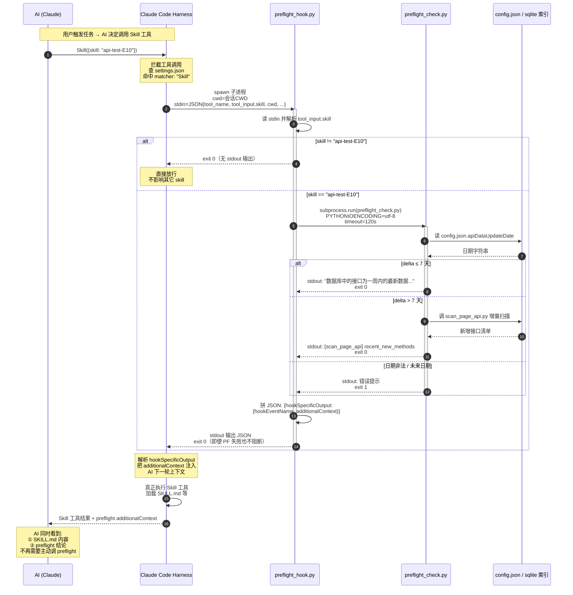

### 关键时序约束（看图配套说明）

| 步骤 | 同步/异步 | 失败处理 |
|---|---|---|
| ②→③ harness 调用 hook | **同步阻塞** | Skill 工具不执行直到 hook 退出 |
| ④ hook 解析 stdin | 同步 | JSON 解析失败 → 直接 exit 0 放行 |
| ⑤ skill 名过滤 | 同步 | 不匹配 → 立即 exit 0，不跑 PF |
| ⑥→⑩ spawn preflight | 同步阻塞 | timeout=120s；超时 → 注入诊断信息但 exit 0 |
| ⑪ JSON 输出 | 同步 | 永远 exit 0（PF 失败也不阻断 Skill） |
| ⑫ 注入 additionalContext | 由 harness 处理 | 作为 system 消息进 AI 上下文 |

### 关键设计取舍

- **永不阻断**：即便 preflight 自己崩了，hook 也 exit 0；宁可让 AI 看到诊断信息自行判断，也不要因 hook 故障让 skill 整个不可用。如需强制阻断，把 hook 末尾改成按 `result.returncode` 决定 exit 2。
- **二次过滤放在脚本里**：`matcher: "Skill"` 在 settings 层只能按工具名匹配，无法区分具体 skill 名；脚本内 `skill_name == "api-test-E10"` 这层过滤是必须的，否则任何 Skill 调用都会触发 preflight。
- **CWD 取 payload.cwd**：preflight 子进程的 CWD 是用户会话 CWD（消费方项目），不是 hook 脚本所在目录——这样 `skill_utils/project_root.py` 的 fallback 路径搜索能正确落到消费方项目。

